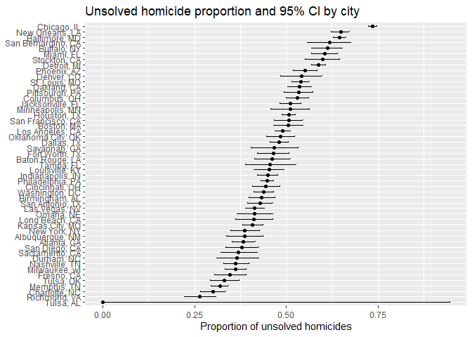

p8105_hw5_wl3013
================
Wen Li_wl3013
2025-11-06

## Problem 1

``` r
has_duplicate_birthday <- function(n) {
  birthdays <- sample(1:365, n, replace = TRUE)
  return(length(unique(birthdays)) < n)
}

# set randomize time and group size
n_sims <- 10000
group_sizes <- 2:50

# save the result of randomization
prob_shared <- numeric(length(group_sizes))

# calculate the probability of each group
for (i in seq_along(group_sizes)) {
  n <- group_sizes[i]
  results <- replicate(n_sims, has_duplicate_birthday(n))
  prob_shared[i] <- mean(results)
}

set.seed(1)
replicate(10, has_duplicate_birthday(5))
```

    ##  [1] FALSE FALSE FALSE FALSE FALSE FALSE FALSE FALSE FALSE FALSE

``` r
# draw the plot
plot(
  group_sizes, prob_shared, type = "b",
  xlab = "Group size (n)",
  ylab = "Probability of shared birthday",
  main = "Birthday Problem Simulation (10,000 runs)"
)
```

<!-- -->

The probability plot shows a smoothly increasing “S” line, indicating
that when the group size grows, the probability of at least two people
share a birthday also grows. When the group size close to the the
maximum group size (n=50), the probability close to 1.

## Problem 2

``` r
# write the function for t-test and save the result
sim_ttest = function(n = 30, mu, sigma = 5) {
  
  x <- rnorm(n, mean = mu, sd = sigma)
  
  t_out <- t.test(x, mu = 0)
  
  tibble(
    mu_true = mu,
    mu_hat = mean(x),
    p_value = t_out$p.value
  )
}

n_sims <- 5000
one_mu_res <- map_dfr(1:n_sims, ~sim_ttest(mu = 0))

# run the function for mu = 0:6
mu_values <- 0:6

all_res <- map_dfr(mu_values, function(m) {
  map_dfr(1:n_sims, ~sim_ttest(mu=m))
} )
```

### Create plot 1

``` r
# calculate the probability of power with p<0.05
power_df <- all_res |>
  group_by(mu_true) |>
  summarize(power = mean(p_value < 0.05))
power_df
```

    ## # A tibble: 7 × 2
    ##   mu_true  power
    ##     <int>  <dbl>
    ## 1       0 0.0514
    ## 2       1 0.188 
    ## 3       2 0.562 
    ## 4       3 0.887 
    ## 5       4 0.985 
    ## 6       5 1     
    ## 7       6 1

``` r
ggplot(power_df, aes(x = mu_true, y = power)) +
  geom_line() +
  geom_point() +
  labs(
    x = "True mean (mu)",
    y = "Power (Pr reject H0)",
    title = "Power vs effect size"
  ) +
  ylim(0, 1) +
  theme_minimal()
```

<!-- -->

The plot shows that statistical power increases as the true mean moves
further from 0. When the effect size is small (mu near 0), the t-test
rarely rejects the null hypothesis. As mu increases, the probability of
detecting a true difference rises sharply, approaching 1 when mu ≥ 5.

### Create plot 2

``` r
# (a) calculate the mean of mu_hat
avg_all <- all_res |>
  group_by(mu_true) |>
  summarize(mu_hat_avg = mean(mu_hat))

# (b) calculate the mean mu_hat with rejected H0
avg_reject <- all_res |>
  filter(p_value < 0.05) |>
  group_by(mu_true) |>
  summarize(mu_hat_reject_avg = mean(mu_hat))

# combine 2 plots
avg_df <- left_join(avg_all, avg_reject, by = "mu_true")

ggplot(avg_df, aes(x = mu_true)) +
  geom_line(aes(y = mu_hat_avg, color = "All samples"), linewidth = 1) +
  geom_point(aes(y = mu_hat_avg, color = "All samples")) +
  geom_line(aes(y = mu_hat_reject_avg, color = "Rejected H0 (p < 0.05)"), linewidth = 1) +
  geom_point(aes(y = mu_hat_reject_avg, color = "Rejected H0 (p < 0.05)")) +
  labs(
    x = "True mean (μ)",
    y = "Average estimated mean (μ̂)",
    title = "Estimated Mean vs True Mean",
    color = "Sample Type"
  ) +
  theme_minimal() +
  scale_color_manual(values = c("All samples" = "steelblue",
                                "Rejected H0 (p < 0.05)" = "firebrick"))
```

<!-- -->

The blue line represents the average estimated mean across all samples,
which closely matches the true mean, showing that the estimator is
unbiased overall. The red line represents the only among samples where
the null was rejected (p \< 0.05). These estimates are systematically
higher than the true mu, reflecting selection bias. Which means
significant results tend to come from samples where random variation
exaggerated the effect. Besides, the difference between the two curves
is largest when power is low (small mu), because only extreme positive
samples yield significant results. As mu increases and the test becomes
more powerful, nearly all samples reject H0, reducing selection bias and
bringing the two averages closer together.

## Problem 3

``` r
# Import data
homicide_df <- read_csv("https://raw.githubusercontent.com/washingtonpost/data-homicides/refs/heads/master/homicide-data.csv")
```

    ## Rows: 52179 Columns: 12
    ## ── Column specification ────────────────────────────────────────────────────────
    ## Delimiter: ","
    ## chr (9): uid, victim_last, victim_first, victim_race, victim_age, victim_sex...
    ## dbl (3): reported_date, lat, lon
    ## 
    ## ℹ Use `spec()` to retrieve the full column specification for this data.
    ## ℹ Specify the column types or set `show_col_types = FALSE` to quiet this message.

``` r
# Create city_state variable and summary
homicide_summary <- homicide_df |>
  mutate(
    city_state = paste(city, state, sep = ", "),
    unsolved = if_else(
      disposition %in% c("Closed without arrest", "Open/No arrest"),
      1, 0
    )
  ) |>
  group_by(city_state) |>
  summarise(
    total_homicides = n(),
    unsolved_homicides = sum(unsolved),
    .groups = "drop"
  )

# Run the prop.test for Baltimore
baltimore <- homicide_summary |> filter(city_state == "Baltimore, MD")
baltimore_test <- prop.test(baltimore$unsolved_homicides,
                            baltimore$total_homicides)
broom::tidy(baltimore_test)
```

    ## # A tibble: 1 × 8
    ##   estimate statistic  p.value parameter conf.low conf.high method    alternative
    ##      <dbl>     <dbl>    <dbl>     <int>    <dbl>     <dbl> <chr>     <chr>      
    ## 1    0.646      239. 6.46e-54         1    0.628     0.663 1-sample… two.sided

``` r
# Write function for running prop.test for all cities
run_prop_test <- function(x, n) {
  # x = number of unsolved homicides
  # n = total number of homicides
  test_result <- prop.test(x = x, n = n)
  tidy_result <- broom::tidy(test_result)
  return(tidy_result)
}

# Run the function and get the prop.test results for all cities
city_prop_test <- homicide_summary |>
  mutate(result = map2(unsolved_homicides, total_homicides, run_prop_test)) |>
  unnest(result)
```

    ## Warning: There was 1 warning in `mutate()`.
    ## ℹ In argument: `result = map2(unsolved_homicides, total_homicides,
    ##   run_prop_test)`.
    ## Caused by warning in `prop.test()`:
    ## ! Chi-squared approximation may be incorrect

``` r
# Create the plot
ggplot(city_prop_test,
       aes(x = reorder(city_state, estimate), y = estimate)) +
  geom_point() +
  geom_errorbar(
    aes(ymin = conf.low, ymax = conf.high),
    width = 0.2
  ) +
  coord_flip() +
  labs(
    x = NULL,
    y = "Proportion of unsolved homicides",
    title = "Unsolved homicide proportion and 95% CI by city"
  )
```

<!-- -->
