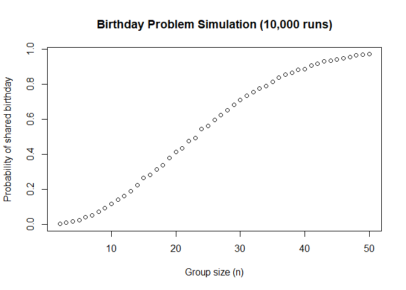
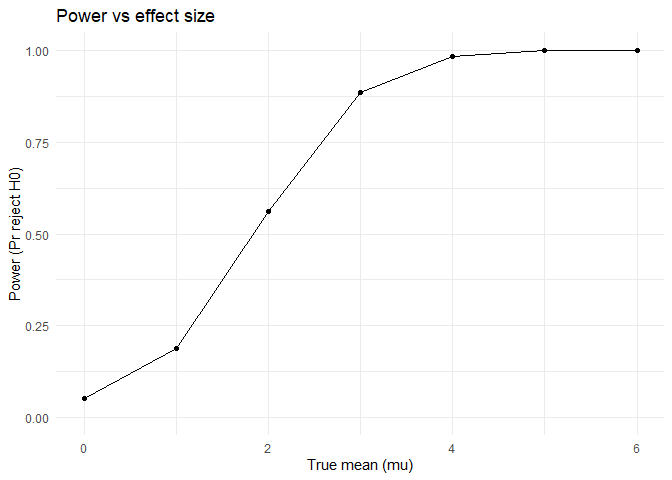
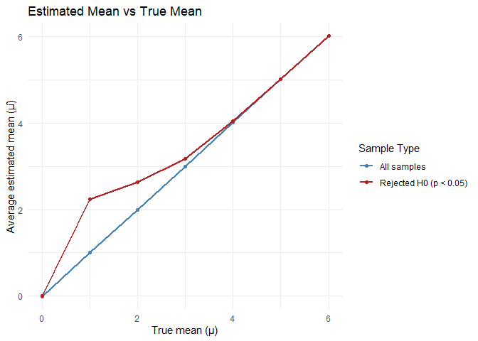

p8105_hw5_wl3013
================
Wen Li_wl3013
2025-11-06

## Problem 1

``` r
has_duplicate_birthday <- function(n) {
  birthdays <- sample(1:365, n, replace = TRUE)
  return(length(unique(birthdays)) < n)
}

# set randomize time and group size
n_sims <- 10000
group_sizes <- 2:50

# save the result of randomization
prob_shared <- numeric(length(group_sizes))

# calculate the probability of each group
for (i in seq_along(group_sizes)) {
  n <- group_sizes[i]
  results <- replicate(n_sims, has_duplicate_birthday(n))
  prob_shared[i] <- mean(results)
}

set.seed(1)
replicate(10, has_duplicate_birthday(5))
```

    ##  [1] FALSE FALSE FALSE FALSE FALSE FALSE FALSE FALSE FALSE FALSE

``` r
# draw the plot
plot(
  group_sizes, prob_shared, type = "b",
  xlab = "Group size (n)",
  ylab = "Probability of shared birthday",
  main = "Birthday Problem Simulation (10,000 runs)"
)
```

<!-- --> The
probability plot shows a smoothly increasing “S” line, indicating that
when the group size grows, the probability of at least two people share
a birthday also grows. When the group size close to the the maximum
group size (n=50), the probability close to 1.

## Problem 2

``` r
# write the function for t-test and save the result
sim_ttest = function(n = 30, mu, sigma = 5) {
  
  x <- rnorm(n, mean = mu, sd = sigma)
  
  t_out <- t.test(x, mu = 0)
  
  tibble(
    mu_true = mu,
    mu_hat = mean(x),
    p_value = t_out$p.value
  )
}

n_sims <- 5000
one_mu_res <- map_dfr(1:n_sims, ~sim_ttest(mu = 0))

# run the function for mu = 0:6
mu_values <- 0:6

all_res <- map_dfr(mu_values, function(m) {
  map_dfr(1:n_sims, ~sim_ttest(mu=m))
} )
```

### Create plot 1

``` r
# calculate the probability of power with p<0.05
power_df <- all_res |>
  group_by(mu_true) |>
  summarize(power = mean(p_value < 0.05))
power_df
```

    ## # A tibble: 7 × 2
    ##   mu_true  power
    ##     <int>  <dbl>
    ## 1       0 0.0514
    ## 2       1 0.188 
    ## 3       2 0.562 
    ## 4       3 0.887 
    ## 5       4 0.985 
    ## 6       5 1     
    ## 7       6 1

``` r
ggplot(power_df, aes(x = mu_true, y = power)) +
  geom_line() +
  geom_point() +
  labs(
    x = "True mean (mu)",
    y = "Power (Pr reject H0)",
    title = "Power vs effect size"
  ) +
  ylim(0, 1) +
  theme_minimal()
```

<!-- -->
comments:

### Create plot 2

``` r
# (a) calculate the mean of mu_hat
avg_all <- all_res |>
  group_by(mu_true) |>
  summarize(mu_hat_avg = mean(mu_hat))

# (b) calculate the mean mu_hat with rejected H0
avg_reject <- all_res |>
  filter(p_value < 0.05) |>
  group_by(mu_true) |>
  summarize(mu_hat_reject_avg = mean(mu_hat))

# combine 2 plots
avg_df <- left_join(avg_all, avg_reject, by = "mu_true")

ggplot(avg_df, aes(x = mu_true)) +
  geom_line(aes(y = mu_hat_avg), color = "steelblue", linewidth = 1) +
  geom_point(aes(y = mu_hat_avg), color = "steelblue") +
  geom_line(aes(y = mu_hat_reject_avg), color = "firebrick", linewidth = 1) +
  geom_point(aes(y = mu_hat_reject_avg), color = "firebrick") +
  labs(
    x = "True mean (mu)",
    y = "Average estimated mean",
    title = "Estimated mean vs true mean"
  ) +
  theme_minimal()
```

<!-- -->
comments:
